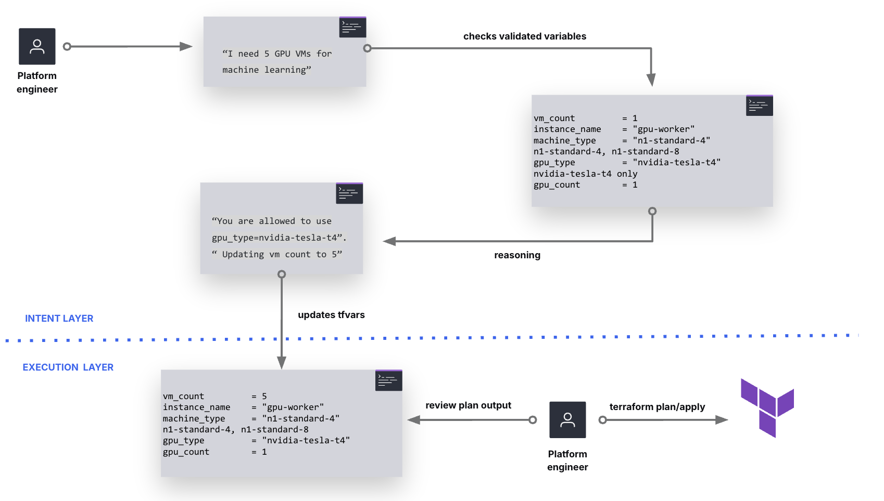
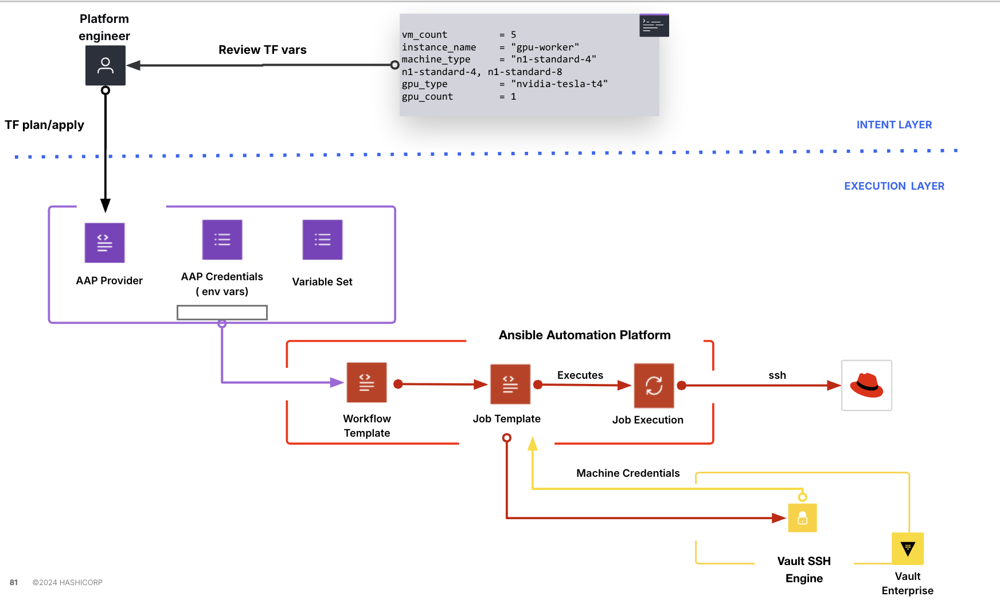

# PromptOps

PromptOps is a demo that lets users describe infrastructure needs in natural language, while keeping Terraform as the single source of truth for what is actually allowed. The LLM does not design infrastructure from scratch — it works within constraints defined by your Terraform modules and helps users pick valid configurations.

## The Key Idea

The LLM does not have free "will"" to design whatever infrastructure it wants. Instead, it selects from options that are explicitly allowed by a platform contract defined in Terraform modules. When a user asks for something outside those boundaries, the LLM refuses and explains what alternatives are available.

```
User: "I need a V100 GPU"

LLM: "Not possible. Platform only offers T4 GPUs.
      Want me to use 2 T4s instead for more power?"
```

The platform boundaries come from Terraform modules with strict validations. The LLM knows what is allowed because PromptOps reads the module files from disk and copies the constraint information directly into the prompt — nothing more, nothing less.

## Quick Start

### With OpenAI

```bash
export OPENAI_API_KEY='sk-...'

cd promptops
python3 -m venv .venv
.venv/bin/pip install -r requirements.txt
.venv/bin/streamlit run web.py
```

### If you prefer to use Ollama ( local)

```bash
export PROMPTOPS_LOCAL=true  

cd promptops
python3 -m venv .venv
.venv/bin/pip install -r requirements.txt
.venv/bin/streamlit run web.py
```


## What You Can Ask

**Valid requests (LLM configures):**
- "I need a GPU VM" → creates VM with T4
- "Make it cheaper" → uses smaller machine type
- "Enable Streamlit access" → opens port 8501
- "Enable disk encryption" → turns on CMEK
- "Use 2 GPUs" → sets gpu_count = 2

**Invalid requests (LLM refuses):**
- "Use a V100" → "Not available. Only T4 allowed."
- "Open port 9000" → "Not supported. Only SSH and Streamlit ports."
- "Use n1-standard-32" → "Not allowed. Only n1-standard-4 or n1-standard-8."
- "500GB disk" → "Out of range. Platform allows 50-200 GB."

## Platform Constraints

The following constraints are enforced by Terraform module validations, not by the LLM. The LLM just reads these constraints and respects them when generating configurations.

| Variable | Allowed Values |
|----------|----------------|
| `machine_type` | n1-standard-4, n1-standard-8 |
| `gpu_type` | nvidia-tesla-t4 |
| `gpu_count` | 1-2 |
| `disk_size_gb` | 50-200 |
| `allow_ssh` | true/false (port 22) |
| `allow_streamlit` | true/false (port 8501) |
| `boot_disk_encrypted` | true/false |

There are no other machine types available, no other GPU options, and no arbitrary ports — just what the modules allow.

## How PromptOps Sends Context To The LLM

The LLM has no background access to your environment. It cannot browse files, call APIs, or discover things on its own. PromptOps explicitly reads specific files from disk and copies sanitized text into the prompt. Here is exactly what happens.

### Files Read

| File | What is extracted |
|------|-------------------|
| `terraform/variables.tf` | Variable names, types, descriptions, defaults |
| `terraform/modules/*/variables.tf` | Validation constraints (allowed values, min/max) |

That is the complete list. No other files are read, no API calls are made, and no cloud resources are accessed.

### What IS Sent to the LLM

The following metadata is extracted from the Terraform files and included in the prompt:

- Variable names (e.g., `machine_type`, `gpu_count`)
- Variable types (e.g., `string`, `number`, `bool`)
- Descriptions from the Terraform files
- Allowed values from `validation` blocks (e.g., `["n1-standard-4", "n1-standard-8"]`)
- Min/max ranges from `validation` blocks (e.g., `50-200`)
- Default values (non-sensitive only)

### What is NOT Sent

- `terraform.tfvars` (your actual values, project IDs, secrets)
- `terraform.tfstate` (infrastructure state)
- Cloud credentials or API keys
- Environment variables
- Any file outside the explicit list above

### Sanitization

Variables marked `sensitive = true` in Terraform have their defaults excluded from what gets sent to the LLM. Only structured metadata is extracted from the files, not raw file contents, and comments are not included.

### Debug Mode

If you want to see exactly what is sent to the LLM, you can enable debug mode:

```bash
export PROMPTOPS_DEBUG_CONTEXT=true
```

This will log the full prompt to the console, show an "LLM Context" expandable panel in the Streamlit UI, and display every file that was read along with byte counts.

### The Flow

The LLM never discovers anything on its own. It only knows what PromptOps explicitly pasted into the prompt.

## Module Structure

```
terraform/
├── main.tf              # Wires modules together
├── variables.tf         # Root variables (what LLM can set)
├── modules/
│   ├── compute_vm/      # VM with GPU, machine type constraints
│   ├── network_policy/  # Firewall rules, only SSH + Streamlit
│   └── encryption_policy/  # CMEK encryption
```

Each module has validation blocks that reject invalid values. For example:

```hcl
variable "machine_type" {
  validation {
    condition = contains(["n1-standard-4", "n1-standard-8"], var.machine_type)
    error_message = "Machine type must be n1-standard-4 or n1-standard-8."
  }
}
```

## Why This Matters

Without modules constraining what is possible, an LLM can suggest any configuration it wants. A user might deploy something expensive or insecure without realizing it. With modules defining strict boundaries, the LLM is bounded to what the platform allows, and Terraform will reject any configuration that does not pass validation anyway.

The difference is between letting an AI design arbitrary infrastructure (which is risky) versus having an AI help users configure a well-defined platform (which is controlled).

## Files

```
promptops/
├── terraform/
│   ├── modules/           # Platform capabilities
│   ├── main.tf            # Module composition
│   └── variables.tf       # What LLM can configure
├── promptops/
│   ├── web.py             # Web UI
│   ├── context_builder.py # Reads modules, builds LLM context
│   └── prompts/           # System prompt with {PLATFORM_CONTEXT}
├── ansible/
│   └── playbooks/         # Day-2 configuration
└── docs/
    └── architecture.md    # Detailed diagrams
```

## End-to-End Infrastructure Flow

PromptOps orchestrates a complete infrastructure pipeline: from user intent to configured VMs, using Terraform Actions, Vault SSH CA, and AAP — all in a single `terraform apply`.

### Architecture Diagram



### End-to-End Flow



### The Complete Flow

1. **User describes intent** → PromptOps LLM generates `terraform.tfvars`

2. **`terraform apply`** runs three phases in sequence:

   **Phase 1 - Vault Provisioning:**
   - Creates SSH secrets engine at `/ssh` (if not exists)
   - Generates CA key pair for signing certificates
   - Creates AppRole with policy for `/ssh/issue/*`
   - Outputs `role_id` and `secret_id` for AAP

   **Phase 2 - VM Creation:**
   - Creates GCP VMs with GPU (1-10 instances)
   - Startup script installs Vault CA public key in `/etc/ssh/trusted-user-ca-keys.pem`
   - Configures `sshd` to trust certificates signed by Vault CA
   - Creates firewall rules (SSH, Streamlit ports)

   **Phase 3 - AAP Trigger:**
   - Terraform Action fires on `after_create`
   - Passes ALL credentials via `extra_vars` (no AAP credential config needed)
   - Waits for job completion

3. **AAP Job Execution:**

   **Play 1 (localhost):** Authenticate to Vault via AppRole, call `/ssh/issue/promptops` to get ephemeral private key + signed certificate

   **Play 2 (target VMs):** SSH using Vault-signed certificate, install packages, deploy Streamlit app

   **Play 3 (localhost):** Securely shred ephemeral SSH keys

4. **Result:** Fully configured VMs, zero static SSH keys, complete audit trail in Vault

### Security Model

**Zero Static Keys** - Traditional SSH stores static keys in AAP forever. With Vault SSH CA, ephemeral keys are generated on-demand with 30-minute TTL, auto-expire, and are fully audit logged.

### AAP Setup (One-Time)

No credentials needed in AAP. Terraform passes everything via `extra_vars`.

| Field | Value |
|-------|-------|
| **Name** | `PromptOps Configure VM` |
| **Inventory** | Any (playbook ignores it) |
| **Project** | Git repo with playbooks |
| **Playbook** | `ansible/playbooks/install_streamlit.yml` |
| **Credentials** | *None required* |

### terraform.tfvars

```hcl
# GCP
project_id = "my-project"
region     = "us-central1"
zone       = "us-central1-a"

# Compute
vm_count     = 2
machine_type = "n1-standard-4"
gpu_type     = "nvidia-tesla-t4"
gpu_count    = 1

# AAP
aap_host            = "https://aap.example.com"
aap_username        = "admin"
aap_password        = "secret"
aap_job_template_id = 30

# Vault
vault_addr      = "https://vault.example.com:8200"
vault_token     = "hvs.xxx"  # Admin token for provisioning
vault_namespace = "admin"    # HCP Vault namespace
```

### Manual Re-run

Re-run AAP configuration without recreating VMs:

```bash
terraform apply -invoke action.aap_job_launch.configure_vm
```
